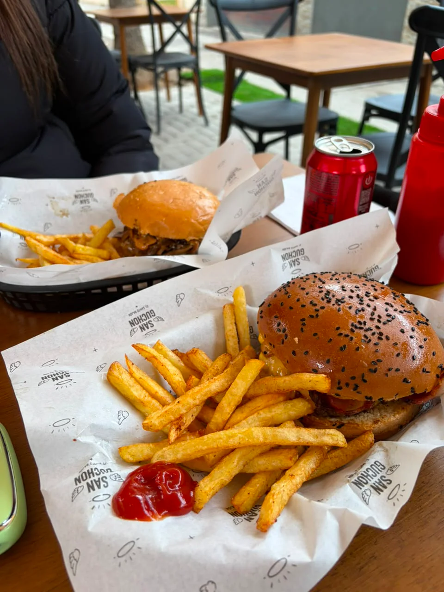

# Sanguchon

Official landing page for **Sanguchon**, a neighborhood burger house in San Miguel, Santiago. The experience combines real fire, signature burgers and an editorial visual system built for fast, responsive browsing.


## Product experience

- Brand hero with a direct menu CTA.
- Animated splash screen focused on the Sanguchon logo.
- Responsive Best Sellers grid using real product photography.
- Interactive **El Milagro** section: burger layers assemble while the user scrolls.
- Dynamic Santoral calendar with today's saint, month navigation and automatic scroll-to-today.
- Brand story, feedback, location map and footer navigation.
- Dark-first visual language with fire, cheese and brioche accents.
- WebP image assets and security headers for compatible static hosts.

## Gallery

| Best Sellers | El Milagro | Santoral promotion |
|:---:|:---:|:---:|
|  |  |  |

## Technology

- [Astro 7](https://astro.build/) for static rendering and `.astro` components.
- [React 19](https://react.dev/) for interactive client islands.
- [Tailwind CSS 4](https://tailwindcss.com/) through `@tailwindcss/vite`.
- [Framer Motion](https://www.framer.com/motion/) for burger anatomy transitions.
- TypeScript for typed data models and React components.
- Sharp for image optimization and WebP processing.

## Architecture

The page follows an **Astro Islands** architecture:

1. Astro renders the static shell, navigation, content sections and footer at build time.
2. React hydrates only interactive experiences such as `BurgerAnatomy` and `SeccionSantoral`.
3. Static content and business data live in `src/data/`, separated from presentation.
4. Public assets are served directly from `public/`, avoiding unnecessary runtime requests.

```text
.
├── public/
│   ├── _headers                  # CSP and security headers for supported hosts
│   ├── images/
│   │   ├── anatomy/              # Burger anatomy layers
│   │   ├── products/             # Burger and product photography
│   │   ├── promos/               # Promotional artwork
│   │   └── venue/                # Store, terrace and atmosphere photography
│   ├── menu-san-guchon.pdf       # Downloadable menu
│   └── favicon.*
├── src/
│   ├── assets/logo-san-guchon.svg
│   ├── components/
│   │   ├── landing/              # Static Astro landing sections
│   │   ├── react/                # Hydrated React islands
│   │   ├── Footer.astro
│   │   ├── Navbar.astro
│   │   └── Splash.astro
│   ├── data/
│   │   ├── menu.ts               # Product catalog data
│   │   ├── santoral.ts           # Date-to-saint data map
│   │   └── site-info.ts          # Contact, map and external URLs
│   ├── layouts/BaseLayout.astro
│   ├── pages/index.astro
│   └── styles/global.css         # Design tokens, responsive CSS and motion
├── astro.config.mjs
├── package.json
└── tsconfig.json
```

## Data architecture

The landing keeps data independent from UI components:

### Product catalog — `src/data/menu.ts`

Each menu item contains its display name, description, price, label, image path and visual metadata. `BestSellers.astro` consumes this data to render consistent cards without duplicating product copy in markup.

To add a product:

1. Optimize the image as WebP.
2. Save it under `public/images/products/`.
3. Add the item to the typed menu collection.

### Santoral calendar — `src/data/santoral.ts`

Santoral entries use an `MM-DD` key:

```ts
{
  "07-13": { names: ["Teresa de los Andes", "Enrique", "Joel"] }
}
```

`SeccionSantoral.tsx` reads the current date in the `America/Santiago` timezone, resolves the names from this map and hydrates the calendar on the client to avoid server/client date mismatches.

### Site configuration — `src/data/site-info.ts`

Centralizes the address, opening hours, Instagram URL, Google Maps URLs, feedback form and downloadable menu. Components consume this object instead of hard-coding external links across the page.

## Installation and development

Requirement: Node.js `>=22.12.0`.

```bash
npm install
npm run dev
```

The development site runs at `http://localhost:4321`.

For a production build and local preview:

```bash
npm run build
npm run preview
```

Astro writes the static output to `dist/`.

## Responsive performance

- Mobile-first layouts scale through Tailwind breakpoints.
- Product photography uses WebP, lazy loading and async decoding where appropriate.
- React islands hydrate only where interaction is required (`client:load` or `client:visible`).
- `prefers-reduced-motion` disables non-essential motion for accessibility.
- Reload handling returns users to the Hero instead of preserving accidental section anchors.

## Security and deployment

- No API keys, tokens or credentials are stored in the repository.
- `.gitignore` excludes all `.env*` files except `.env.example`.
- `public/_headers` provides CSP, HSTS, frame protection, MIME sniffing protection, permissions policy and referrer policy on hosts that support `_headers` (such as Netlify or Cloudflare Pages).
- Run `npm audit --omit=dev --audit-level=high` before every release.
- DDoS protection belongs at the CDN/WAF layer. Put the site behind Cloudflare or an equivalent provider with caching, bot protection, rate limiting and HTTPS enforcement.

## Git workflow

```bash
git switch main
git pull --ff-only
npm install
npm run build
git status
git add .
git commit -m "describe the change"
git push origin main
```

## Ownership

The Sanguchon brand, copy, photography, menu and promotional artwork belong to Sanguchon. Use the Feedback section in the landing to collect customer input.
